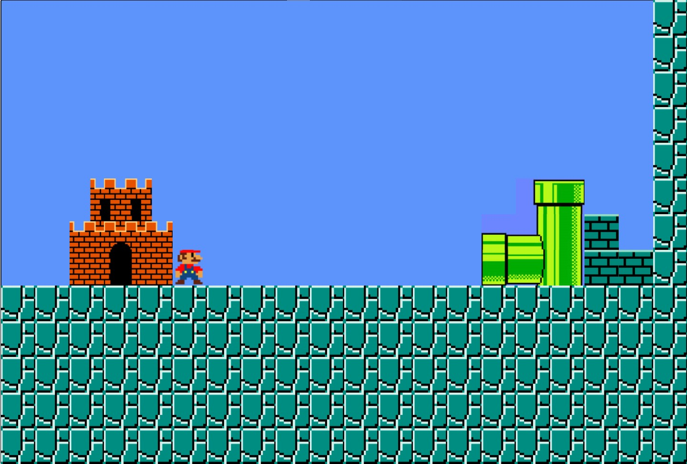
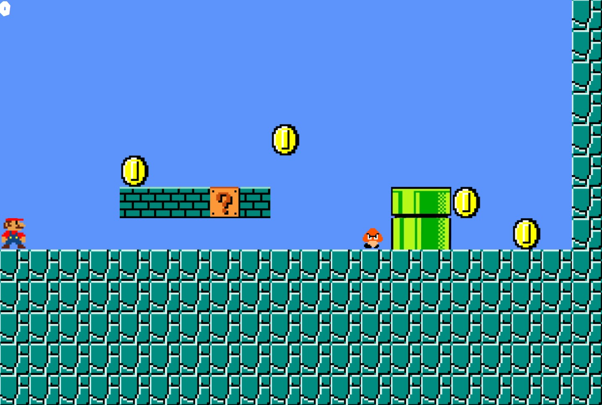
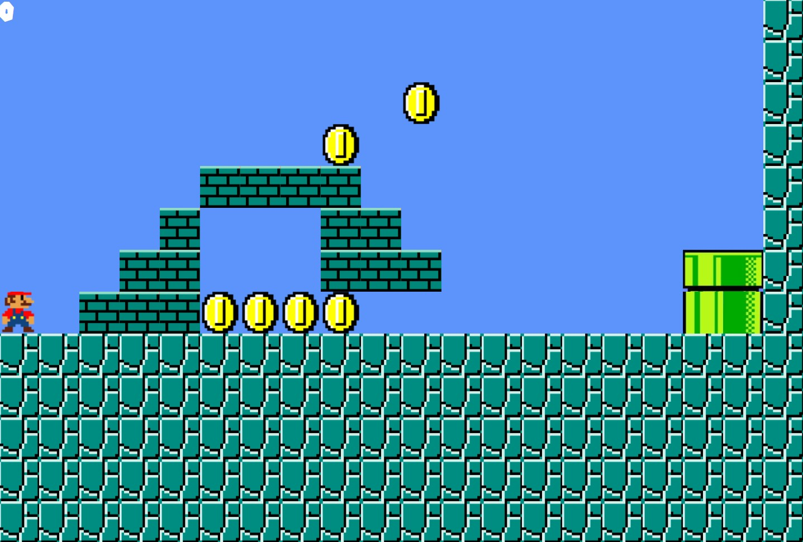
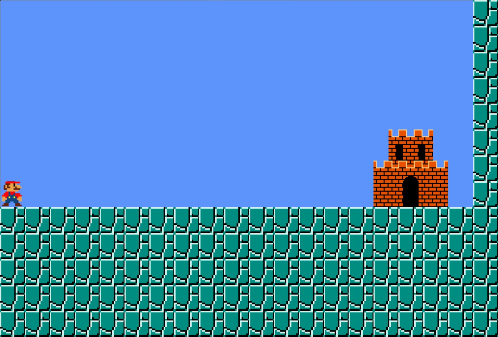

# AppleSeeds Bootcamp Mid Project  

## Super Mario Project (DESKTOP ONLY)

### This Project was made by using React and JavaScript

[SuperMario Project Link](https://rougenij-supermario.netlify.app/)

# How to play :

1. Mario moves by using Left Right Up Arrow key.
2. If you reach near a pipe. Press Right Arrow or Down Arrow to enter the pipe
3. 10 coins are spread around the world. collect them
4. Have fun and enjoy :)

# RoadBlocks that i faced doing this project:

1. MarioFall Function
2. MarioMoving Function
3. updateMap function

# JS Functions:

All the JS functions are found inside Utilis folder
the JS files are the following:

1. matrixWorld -> Inside this file i coded the generation of the world
2. player -> Inside this file i coded the movement of Mario

# Current state of the project :

Starting World:

First World:

Second World

Ending World

If you reach the end you'll be sent to this:

## Future Plans for this project:

1. Monster Function -> That makes the monster move "The monster thats placed in the World one, "Goomba" "
2. Adding Sound Effects -> Adding audio the game is a must add! Original Mario theme song, and different one for different Worlds
3. More Worlds -> More Worlds to be added to this game!
4. Better movement to mario with abit of animation
5. Making the game responsive, We are in the phone generation world.. Soo web apps gotta be Mobile responsive
6. Fully Working CRUD system
7. Highscore -> Top 10 Players to be shown at the start of the game
8. Rules Page -> Currently i have button that does nothing
9. Admin Panel button -> Asks for password
10. Better Authentication -> Basically checks if user already exists in API.. better google login

### CopyRight Claim

[Nintendo](https://www.nintendo.com/)
